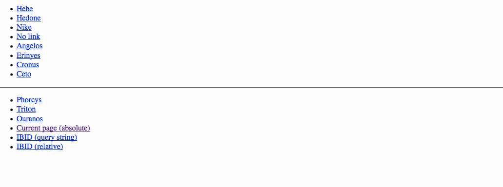

# jQuery Harmonia



## About

Replace an (un)ordered list with a form select.

### Inspired by:

* [Menutron](https://github.com/micjamking/Menutron)
* [jQuery Responsive Menu Plugin](https://github.com/mattkersley/Responsive-Menu)
* [CSS-TRICKS: Convert Menu to Dropdown](http://css-tricks.com/examples/ConvertMenuToDropdown/optgroup.php)

## Demonstration

Click or scan:

[](http://registerguard.github.com/jquery-harmonia/demo/)

Resize the browser window to see the plugin(s) in action (Firefox 15+ users, check out [Responsive Design View](https://developer.mozilla.org/en-US/docs/Tools/Responsive_Design_View)).

**Source:** [jquery.harmonia.js](https://raw.github.com/mhulse/jquery-harmonia/gh-pages/harmonia/jquery.harmonia.js) | [jquery.harmonia.min.js](https://raw.github.com/mhulse/jquery-harmonia/gh-pages/harmonia/jquery.harmonia.min.js)

## Installation

There are several ways to install this code:

1. Download as a [`zip`](https://github.com/mhulse/jquery-harmonia/archive/gh-pages.zip).
1. Clone it: `$ git clone https://github.com/mhulse/jquery-harmonia.git`.
1. Fork it and clone: `$ git clone git@github.com:USERNAME/jquery-harmonia.git`.
1. Just grab the relevant [JS](https://raw.github.com/mhulse/jquery-harmonia/gh-pages/harmonia/jquery.harmonia.js) ([uglified](https://raw.github.com/mhulse/jquery-harmonia/gh-pages/harmonia/jquery.harmonia.min.js)) files.
1. Using [Bower](http://bower.io/): `$ bower install https://github.com/mhulse/jquery-harmonia.git`.

## Usage

Setting up Harmonia is simple …

### Markup:

```html
<ul class="myList">
	<li><a href="http://en.wikipedia.org/wiki/Hebe_(mythology)">Hebe</a></li>
	<li><a href="http://en.wikipedia.org/wiki/Hebe_(mythology)">Hedone</a></li>
	<li><a href="http://en.wikipedia.org/wiki/Nike_(mythology)">Nike</a></li>
	<li><a href="#">No link</a></li>
	<li><a href="http://en.wikipedia.org/wiki/Angelos_(Greek_mythology)">Angelos</a></li>
	<li><a href="http://en.wikipedia.org/wiki/Erinyes">Erinyes</a></li>
	<li><a class="selected" href="http://en.wikipedia.org/wiki/Cronus">Cronus</a></li>
	<li><a href="http://en.wikipedia.org/wiki/Ceto">Ceto</a></li>
</ul>
```

### Styling:

No styling is required, but you can optionally use CSS media queries to show/hide the HTML list/form select(s) as necessary.

### Javascript:

Put [jQuery](http://jquery.com/) on your page:

```html
<script src="//ajax.googleapis.com/ajax/libs/jquery/2.1.1/jquery.min.js"></script>
```

… and link to the plugin:

```html
<script src="jquery.harmonia.min.js"></script>
```

Finally, instantiate the plugin:

```html
<script>
	$(document).ready(function() {
		$('.myList').harmonia();
	});
</script>
```

Here’s an example with all the options:

```html
$('.myList').harmonia({
	currentPage   : false,
	optionDefault : 'Choose ...',
	openTab       : false,
	classSelect   : 'harmonia-select',
	classInit     : 'harmonia-js-enabled',
	use           : 'before',
	idSelect      : '#foo',
	elementId     : 'before',
	onInit        : function(data) { console.log('onInit:', $(this), data); },
	onAfterInit   : function(data) { console.log('onAfterInit:', $(this), data); },
	onAddOption   : function(data, return) { console.log('onAddOption:', $(this), data, return); },
	onChange      : function(data, el) { console.log('onChange:', $(this), el); }
});
```

… where:

Option | Description | Default
:-- | :-- | :--
`currentPage` | Select the current page? | `false`
`defaultOption` | Default option for `<select>`. | `'Choose ...'`
`openTab` | Open link in new tab? Default is current window. | `false`
`selectClass` | Class name for `<select>`; class applied to generated `<select>` element(s). | `'harmonia-select'`
`classInit` | Target menu; class name applied to instantiated element(s). | `'harmonia-js-enabled'`
`use` | Replacement function to use when adding `<select>` to the DOM. Allowed values are `after`, `append`, `before`, `html`, and `prepend`. | `'before'`
`idSelect` | ID name for `<select>`. | `''`
`elementId` | Target element ID for `<select>`. | `''`
`onInit` | Callback after plugin data initialized. | `$.noop`
`onAfterInit` | Callback after plugin initialization. | `$.noop`
`onAddOption` | Callback when a new option has been added. | `$.noop`
`onChange` | Callback when `<select>` changes. | `$.noop`

### Advanced:

1. All options can be overidden via an [HTML5 data attribute](https://developer.mozilla.org/en-US/docs/Web/Guide/HTML/Using_data_attributes) named `data-harmonia-options`; the value of this attribute **must** be valid [JSON](http://json.org/) syntax.

 For example:

 ```html
 <ul class="myList toDestroy" data-harmonia-options='{ "classSelect" : "omgWtf", "idSelect" : "yolo", "elementId" : "#target", "use" : "after" }'> ... </ul>
 ```

 **Note** the nesting order of the single (`'`) and double (`"`) quotes.

1. All options may be defined statically, before plugin initialzation, using: `$.fn.harmonia.defaults.XXX = 'foo';` (where `XXX` is name of option).

[Check out the demo page](http://mhulse.github.com/jquery-harmonia/demo/) for working examples of the aforementioned features.

## Contributing

Please read the [CONTRIBUTING.md](https://github.com/mhulse/jquery-harmonia/blob/gh-pages/CONTRIBUTING.md).

## Feedback

[Bugs? Constructive feedback? Questions?](https://github.com/mhulse/jquery-harmonia/issues/new?title=Your%20code%20sucks!&body=Here%27s%20why%3A%20)

## Changelog

* [v1.1.0 milestones](https://github.com/mhulse/jquery-harmonia/issues?direction=desc&milestone=2&page=1&sort=updated&state=closed)
* [v1.0.0 milestones](https://github.com/mhulse/jquery-harmonia/issues?direction=asc&milestone=1&page=1&sort=updated&state=closed)

## [Release history](https://github.com/mhulse/jquery-harmonia/releases)

* 2014-06-26   [v1.1.0](https://github.com/mhulse/jquery-harmonia/releases/tag/v1.1.0)   Über!
* 2014-04-14   [v1.0.0](https://github.com/mhulse/jquery-harmonia/releases/tag/v1.0.0)   Stable.
* 2012-08-05   [v0.1.0](https://github.com/mhulse/jquery-harmonia/releases/tag/v0.1.0)

---

#### LEGAL

Copyright © 2013-2014 [Micky Hulse](http://mky.io)

Licensed under the Apache License, Version 2.0 (the “License”); you may not use this work except in compliance with the License. You may obtain a copy of the License in the LICENSE file, or at:

[http://www.apache.org/licenses/LICENSE-2.0](http://www.apache.org/licenses/LICENSE-2.0)

Unless required by applicable law or agreed to in writing, software distributed under the License is distributed on an “AS IS” BASIS, WITHOUT WARRANTIES OR CONDITIONS OF ANY KIND, either express or implied. See the License for the specific language governing permissions and limitations under the License.


